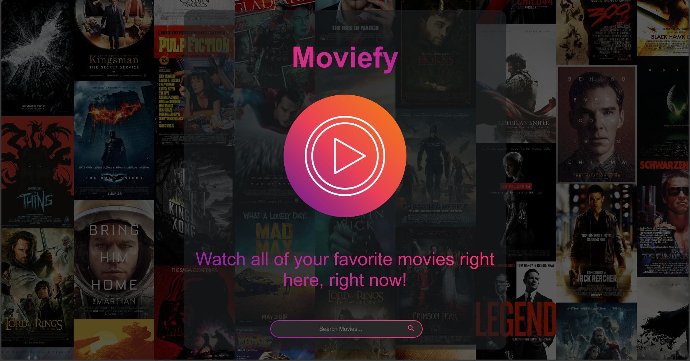
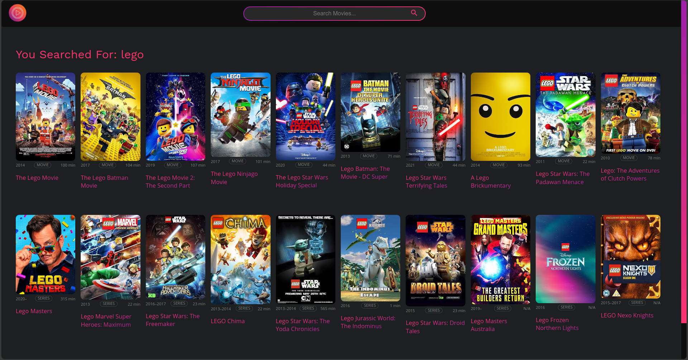
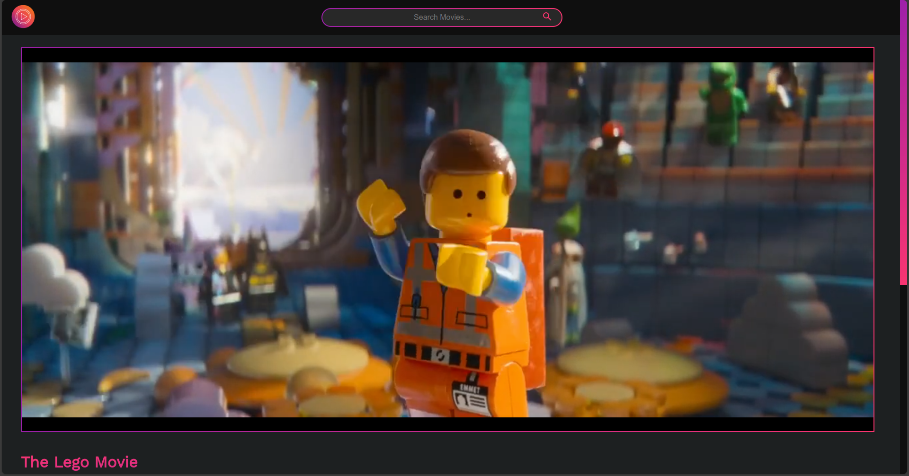
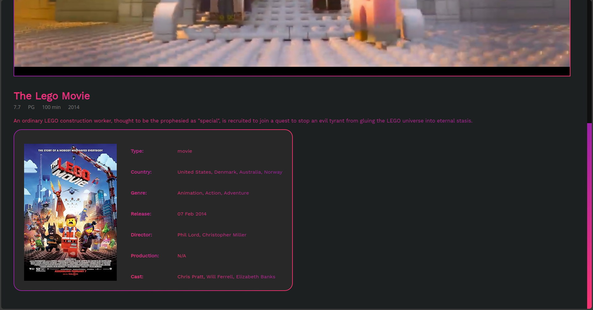

<div align="center">
  

  <a href="https://moviefy-six.vercel.app"></a>
    
  A free movie streaming service that allows you to watch a large selection <br>
  of your favorite movies and TV series with no registration, no purchase, <br>
  and no hidden fees—just pure, continuous streaming at your fingertips
  <p>
    
  </p>
</div>

<div align="center">
  
  
  
</div>


# Tech Stack
<div align="left">
  
  
  
</div>

# Features
- Accurate movie and TV show searches and important information when viewing movies and TV shows.
- Can display extensive information about each movie or television show, including plot, actors, ratings, and more!
- Support for streaming videos with unique playback controls.
- Support numerous subtitle languages. (depends on the movie or TV show)
- There is no need for a monthly or yearly subscription.
- No account registration is required to browse the website (though the drawbacks of this will be explained below).

# Drawbacks [WIP]
- Some movies and TV shows wouldn't play if `VidSrc` could not find the video file.
- Some movies and TV shows display their own poster size, and there's nothing I can do with that since posters are provided by the `OMDB` API.
- The website feels empty, has lots of dead spots, and lacks so many features: smart search, display of related or recommended movies or TV shows, etc.
- Since there's no need for you to have an account, you cannot mark movies or TV shows as one of your favorites.
- Unfortunately, there are ads when you keep interacting with the video player. (I'll find a fix for this, if there even is one.)


# Pagination 
`Moviefy` only has a fixed number of search results of `20`: 
  - `10` for `Type: movie`
  - `10` for `Type: series`

The reason being is that, first, the free `APIKEY` has a limit of `1,000` requests per day. Second, even with `pagination`, it's originally locked to `10` search results only.
So I have to implement and re-adjust `script.js` to output `20` search results. Some searches would only produce `5` or maybe even `8` search results;
this is just due to filtering because `OMDB` can also output `Type: game` sometimes, and movie title popularity.

If you do, however, want to change the number of search results, you can just manipulate this in the `script.js`:
```js
const pages = [1]; // You can add number into this array to increase the number of search results.
const fetchPromises = pages.map(page_number => fetchMoviesAndTVShows(query, page_number)); // Per number = 20 search results
const results = await Promise.all(fetchPromises);
```


# APIs used
- [OMDB](https://www.omdbapi.com/) - This API is used to get movie posters, information, and its `IMDB ID`.
- [VidSrc](https://vidsrc.me/) - This API is used to stream the movie or TV show. This domain can change since some are shut down.

# License
The Moviefy Streaming Platform Website is open-source and released under the [Apache License 2.0](LICENSE)


